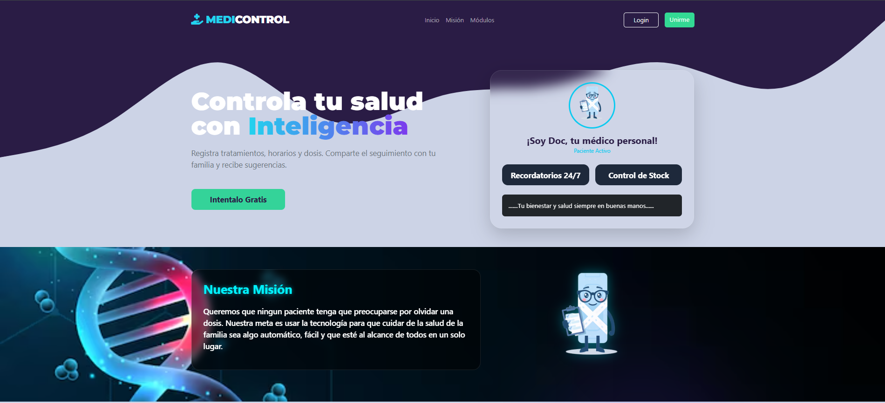
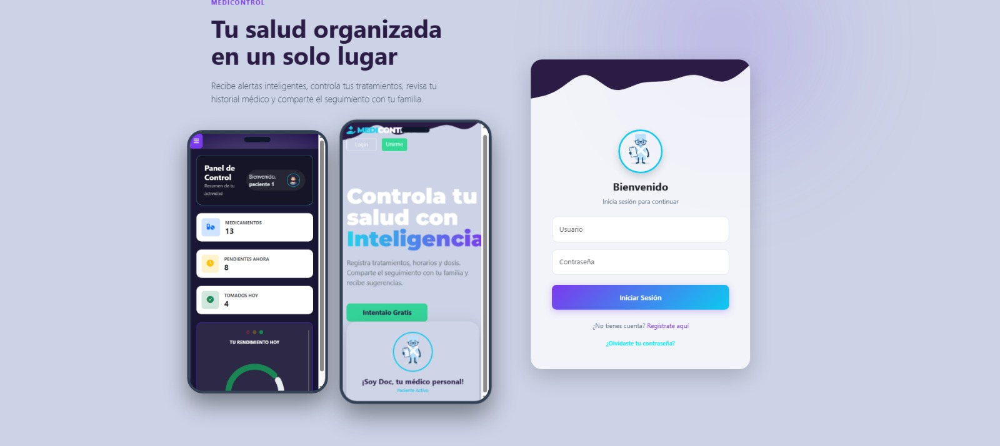
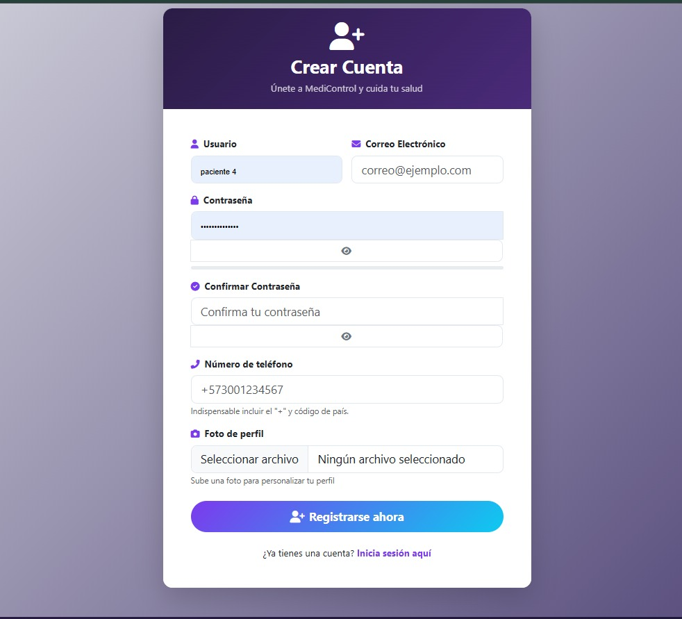
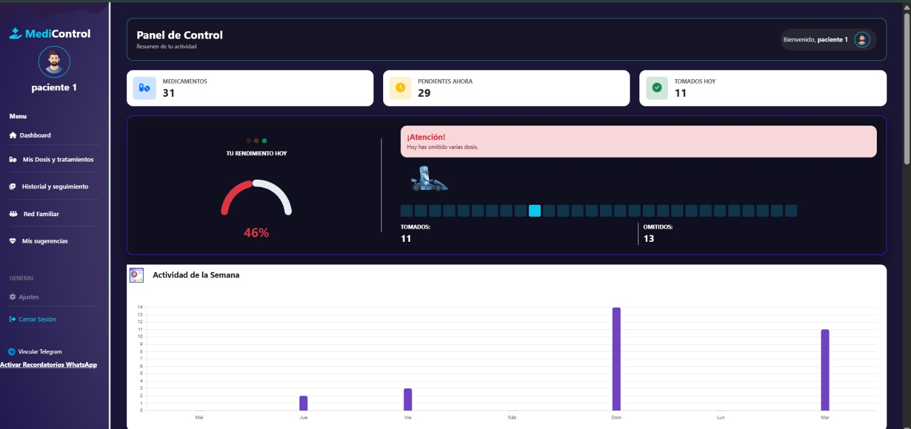
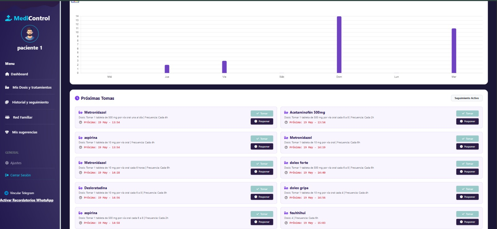
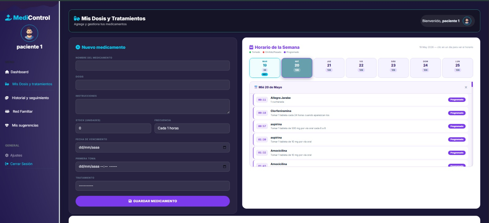
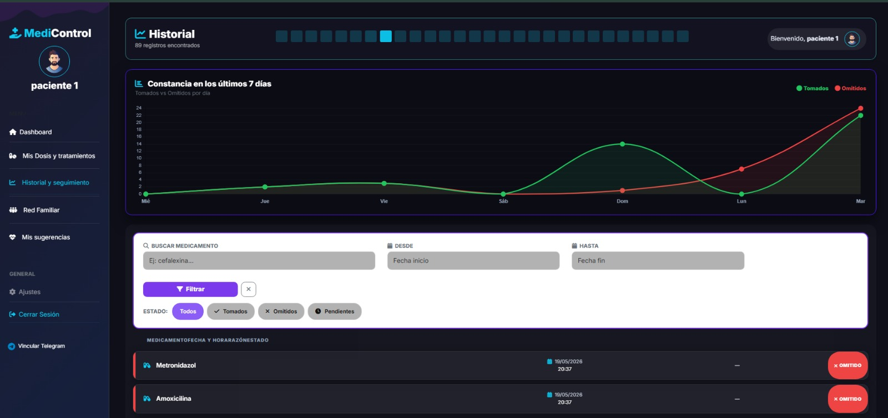
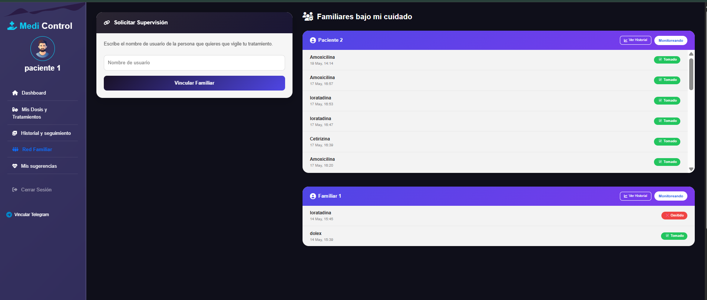
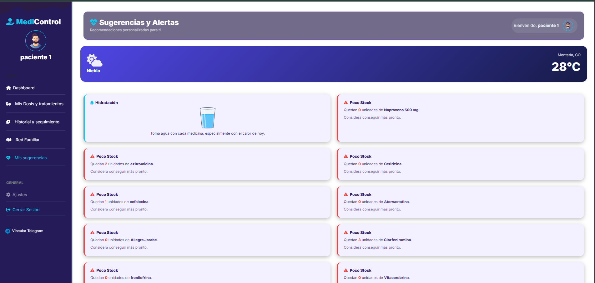
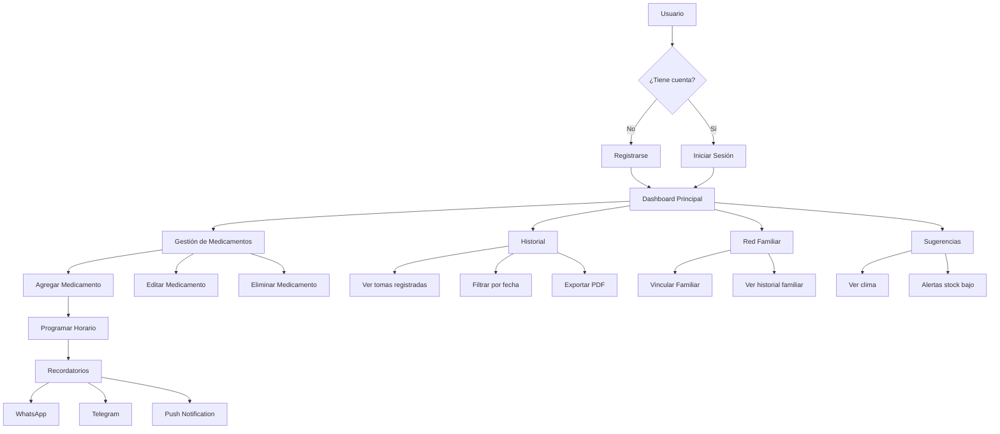

# MediControl

**Sistema de control de medicamentos con recordatorios, seguimiento familiar y sugerencias personalizadas**

---
### Descripcion General
**MediControl** es una aplicación web desarrollada con el framework Django que tiene como objetivo principal ayudar a
los pacientes a gestionar sus tratamientos médicos de manera eficiente, organizada y personalizada. 
El sistema permite registrar medicamentos, controlar horarios de toma, recibir recordatorios automáticos y compartir el seguimiento con familiares.

---
###  Objetivo general

Desarrollar una plataforma digital que facilite la adherencia a los tratamientos farmacológicos mediante recordatorios inteligentes, control de stock
y seguimiento familiar, mejorando así la calidad de vida de los pacientes.

---

### Funcionalidades principales:
- Registro y autenticación de usuarios
- Gestión completa de medicamentos (CRUD)
- Control de stock y fechas de vencimiento
- Recordatorios por WhatsApp, Telegram y Push
- Historial de tomas con filtros
- Gráficos estadísticos de adherencia
- Red familiar para supervisión
- Sugerencias basadas en clima y stock bajo
- Recuperación de contraseña por correo
- Panel de control con métricas

---

##  Tecnologías usadas

- **Django 6.0** - Backend
- **Bootstrap 5** - Frontend responsive
- **SQLite3** - Base de datos
- **Chart.js** - Gráficos estadísticos
- **Firebase Cloud Messaging** - Notificaciones push
- **Twilio API** - Notificaciones WhatsApp
- **Telegram Bot API** - Notificaciones Telegram
- **OpenWeatherMap API** - Clima en tiempo real
- **Git / GitHub** - Control de versiones

---

###  Diseño y experiencia de usuario

- Interfaz moderna y responsive desarrollada con Bootstrap 5
- Colores intuitivos para identificar el estado de las tomas (verde: tomado, rojo: omitido)
- Acceso desde cualquier dispositivo (computadora, tablet, celular)
- Feedback visual con SweetAlert2 para acciones importantes

---

## Requisitos del sistema

- Python 3.10 o superior
- Pip (gestor de paquetes)
- Git
- Navegador web actualizado

---

## Evidencias De Modulos 

### Pantalla de inicio (Landing)


### Inicio de sesión


### Registro de usuario


### Panel de control (Dashboard)



### Gestión de medicamentos



### Historial


### Red familiar


### Sugerencias

---
##  Diagrama de flujo del sistema



##  Instrucciones de instalación

### 1. Clonar el repositorio
```bash
git clone https://github.com/Medicontrol/medicontrol.git
cd medicontrol


### 2. Crear y activar el entorno virtual
python -m venv env
env\Scripts\activate

### 3. Instalar Dependencias
pip install -r requirements.txt

### 4. Ejecutar Migraciones
python manage.py makemigrations
python manage.py migrate

### 5. Crear Super Usuario
python manage.py createsuperuser

### 6. Iniciar Servidor
python manage.py runserver


